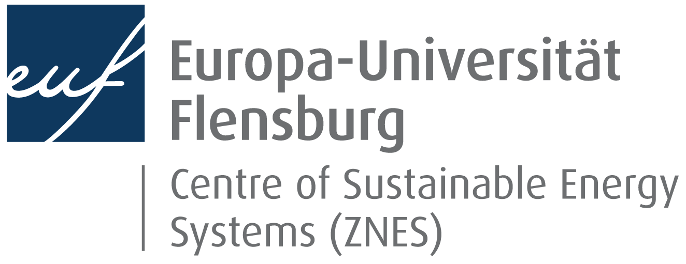

# short-term-forecasting <!-- omit in toc -->

[](https://www.gnu.org/licenses/gpl-3.0) 
[](https://www.gnu.org/licenses/fdl-1.3) 
[](https://creativecommons.org/licenses/by-sa/4.0/)
[](https://opendatacommons.org/licenses/odbl/)

Short-term forecasting of electricity generation, demand and prices using machine learning, by Nithiya Streethran (nmstreethran@gmail.com).

This is a work-in-progress. Please feel free to suggest improvements (see the [code of conduct](CODE_OF_CONDUCT.md) and [contributing guidelines](CONTRIBUTING.md)). 

## Table of contents <!-- omit in toc -->

- [Folders](#folders)
- [Documentation](#documentation)
- [Resources](#resources)
- [Funding](#funding)
- [Licenses and terms of use](#licenses-and-terms-of-use)
- [Credits](#credits)

## Folders

* [data](https://www.dropbox.com/sh/vjo4gkfk6dlye6h/AAAQNltY7-Y4N9SQYjGZDHY5a?dl=0) contains datasets (both input and output) and their terms of use (available externally on Dropbox)
* [scripts](scripts/) contains all Python scripts
* [jupyter-notebooks](jupyter-notebooks/) contains Python files with outputs in Jupyter notebook format
* [docs](docs/) contains the documentation and associated files 
* [images](images/) contains images and their license

## Documentation

Documentation is written in the repository's [GitHub Wiki](https://github.com/ENSYSTRA/short-term-forecasting/wiki). The [docs](docs/) folder contains the documentation and associated files in Markdown, [HTML](docs/index.html) and [PDF](docs/docs.pdf) formats. 

## Resources 

The source code editor I use is [VSCodium](https://vscodium.github.io/) (fully open-source alternative to [Visual Studio Code](https://code.visualstudio.com/)), with Git integration and the following useful extensions:

* [Anaconda Extension Pack](https://marketplace.visualstudio.com/items?itemName=ms-python.anaconda-extension-pack)
* [Python](https://marketplace.visualstudio.com/items?itemName=ms-python.python)
* [Visual Studio IntelliCode](https://marketplace.visualstudio.com/items?itemName=VisualStudioExptTeam.vscodeintellicode)
* [Code Spell Checker](https://marketplace.visualstudio.com/items?itemName=streetsidesoftware.code-spell-checker)
* [Markdown All in One](https://marketplace.visualstudio.com/itemdetails?itemName=yzhang.markdown-all-in-one)
* [GitLens — Git supercharged](https://marketplace.visualstudio.com/items?itemName=eamodio.gitlens)

Document conversion is performed using [Pandoc](https://pandoc.org/MANUAL.html), with [pandoc-citeproc](https://github.com/jgm/pandoc-citeproc) and [pandoc-crossref](https://github.com/lierdakil/pandoc-crossref). The shell commands used are written in [`docsshellscript`](docsshellscript), which is then executed in Bash using the following command:

```sh
bash docsshellscript
```

My current computing specifications:

* Python version 3.6.8
* conda version 4.6.11
* git version 2.18.0.windows.1
* Processor: Intel(R) Core(TM) i5-7200U CPU @ 250 GHz 2.71 GHz
* RAM: 8 GB
* Default shell: Bash

## Funding

This work is part of my research as Early-Stage Researcher (ESR) 9 of the [ENSYSTRA (ENergy SYStems in TRAnsition)](https://ensystra.eu/) Innovative Training Network at the University of Stavanger. ENSYSTRA is funded by the European Union's Horizon 2020 research and innovation programme under the Marie Skłodowska-Curie grant agreement No: 765515.

<p align=center>&nbsp;&nbsp;&nbsp;</p>

<p align=center>&nbsp;&nbsp;&nbsp;&nbsp;&nbsp;&nbsp;</p>

<p align=center>&nbsp;&nbsp;&nbsp;&nbsp;&nbsp;&nbsp;&nbsp;&nbsp;&nbsp;&nbsp;&nbsp;&nbsp;</p>

## Licenses and terms of use

Where sources have not been specified:

* Code license: [GNU General Public License Version 3](LICENSE.md)
* Documentation license: [GNU Free Documentation License Version 1.3](docs/License.md)
* Image license: [Creative Commons Attribution-ShareAlike 4.0 International (CC BY-SA 4.0)](images/LICENSE.md)
* Output data license: [ODC Open Database License (ODbL)](data/output/LICENSE.md)

Licenses and terms of the input data used can be found in their corresponding folders within the [data](https://www.dropbox.com/sh/vjo4gkfk6dlye6h/AAAQNltY7-Y4N9SQYjGZDHY5a?dl=0) folder on Dropbox. More information is provided in the [wiki](https://github.com/ENSYSTRA/short-term-forecasting/wiki).

## Credits

Contributing guidelines: adapted from the [Open Science MOOC](https://github.com/OpenScienceMOOC/Module-5-Open-Research-Software-and-Open-Source/blob/master/CONTRIBUTING.md).

License badges: [lukas-h/license-badges.md](https://gist.github.com/lukas-h/2a5d00690736b4c3a7ba); made with [Shields.io](http://shields.io/).

Markdown-formatted Creative Commons licenses: [idleberg/Creative-Commons-Markdown](https://github.com/idleberg/Creative-Commons-Markdown).

[IEEEurl.csl](docs/IEEEurl.csl): Citation Style Language for [Zotero](https://www.zotero.org/), originally by [Michael Berkowitz](mailto:mberkowi@gmu.edu), [Julian Onions](mailto:julian.onions@gmail.com), [Rintze Zelle](http://twitter.com/rintzezelle), [Stephen Frank](http://www.zotero.org/sfrank) and Sebastian Karcher.

[pandoc.css](docs/pandoc.css): CSS for HTML documents generated using Pandoc, originally by [killercup](https://gist.github.com/killercup/5917178#file-pandoc-css).

[pandoc.tex](docs/pandoc.tex): LaTeX template for formatting PDFs generated using Pandoc and a LaTeX PDF engine, originally downloaded from Pandoc's [demo page](https://pandoc.org/demo/template.tex).
