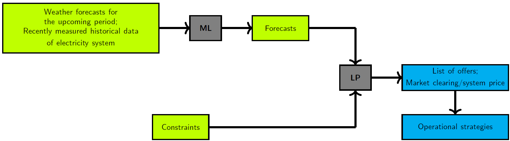

<!-- 
- [Methodology](#Methodology)
 -->

# Methodology

In progress

<!-- ## Modelling framework -->

<!--  -->

<!-- ## Data management -->

<!-- ## Time series forecasting -->

<!-- * Variable renewable energy generators
  * Installed capacity
  * Capacity factor
  * Available capacity (installed capacity * capacity factor)
* Conventional generators
  * Installed capacity
  * Fuel efficiency
  * Availability (either available or unavailable)
  * Fuel cost
  * Fuel consumption
  * Fuel price
  * Fuel energy value -->

<!-- ## Market optimisation -->

<!-- ## Translating inputs and outputs into operational strategies -->

<!-- ## Standardisation and publication of model -->

<!-- ## Integrating operational time scales with long-term energy systems models  -->

  <!-- - [Market optimisation](../wiki/Methodology#market-optimisation)
  - [Translating inputs and outputs into operational strategies](../wiki/Methodology#translating-inputs-and-outputs-into-operational-strategies)
  - [Standardisation and publication of model](../wiki/Methodology#standardisation-and-publication-of-model)
  - [Integrating operational time scales with long-term energy systems models](../wiki/Methodology#integrating-operational-time-scales-with-long-term-energy-systems-models) -->
