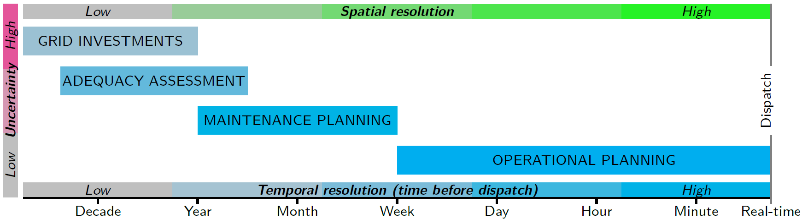
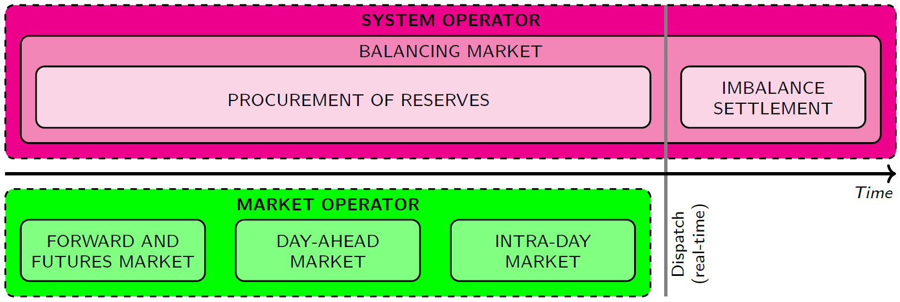

<!-- 
- [Problem definition](#Problem-definition)
  - [Electricity system](#Electricity-system)
  - [Generation technologies](#Generation-technologies)
  - [Electricity market](#Electricity-market)
 -->

# Problem definition

## Electricity system 

The electricity system can be seen as having two components; the physical grid consisting of generators and transmission and distribution systems, and the electricity market consisting of a number of actors [Erba16]. 

Electricity systems exist in different resolutions and levels of uncertainty. The figure below represents the different scales of electricity systems, mainly in terms of temporal resolution, but also uncertainty and spatial resolution [Glis18], [Pfen14]. Temporally, "real-time" is referred to as the time of dispatch. It can be observed that the operational planning scale has high spatial and temporal resolution, and relatively low uncertainty. Operational planning includes dispatch planning and plant scheduling (i.e., unit commitment), which ranges from a few minutes to a week before dispatch. Maintenance planning can take a few weeks to years, as it involves upgrade and maintenance work which may require shut-down of units or assets, in turn affecting the availability of generation units and grid infrastructure. Adequacy assessments, which takes years, involve assessing the existing generation and storage capacities and planning for new installations based on demand projections, to ensure this demand will be met in the future. Finally, grid investment decisions, including planning transmission and distribution grid networks, cross-border and regional interconnections and grid capacity expansions, take many years to decades and have very high uncertainty as a result.

*The various scales of electricity systems in terms of their approximate temporal resolution, as well as spatial resolution and uncertainty, adapted from Glismann 2018 and Pfenninger, et al. 2014 [Glis18], [Pfen14].*

## Generation technologies

The table below shows the characteristics of the main energy generation technologies, including their costs. These generation sources have different variabilities, fuel types, flexibilities, costs and carbon emissions. According to the EU reference scenario 2016 [EnerND], wind and solar energy resources, which are VRE resources, are expected to generate a total of 35 % of EU's electricity by 2050, which is a significant increase (23 %) from 2015 levels. Conversely, generation from nuclear and solids, which are not variable and provide base load generation, are expected to decrease significantly. Unlike conventional generators, VRE are intermittent as they are dependent on atmospheric conditions, such as wind speed and cloud cover, and they vary both spatially (i.e., location-dependent) and temporally [Josk11]. Therefore, VRE generation cannot be controlled to meet the demand patterns and needs of the energy system [Josk11], which is a challenge to electricity and energy system operators in general. The costs listed in this table are derived based on National Renewable Energy Laboratory (NREL)'s NREL-SEAC 2008 Data Set [Tidb10]. VRE generation technologies have high capital expenditure (CAPEX) compared to conventional fossil-powered and biomass generation. Conversely, the operational expenditure (OPEX), which includes fuel and fixed operational and maintenance (O&M) costs, is low for VRE generation technologies, as they have no fuel costs unlike conventional generators.

*Characteristics of the main energy generation technologies, adapted from Erbach 2016 [Erba16] and Tidball, et al. 2010 [Tidb10].*

**Type**[[f1]](#f1) | **Variable** | **Fuel type** | **Flexibility** | **Low carbon** | **CAPEX** | **OPEX** | **LCOE**[[f2]](#f2)
---|---|---|---|---|---|---|---
Coal | no | fossil | medium | no | low | high | very low 
Natural gas | no | fossil | high | no | very low | very high | low 
Biomass | no | renewable | medium | yes[[f3]](#f3) | low | very high | very high
Nuclear | no | nuclear | low | zero-emission | medium | medium | medium
Hydro | no | renewable | very high | zero-emission | | |
Solar | yes | renewable | very low | zero-emission | very high | very low | very high
Wind | yes | renewable | very low | zero-emission | | | 
*Onshore wind* | | | | | high | very low | very low 
*Offshore wind* | | | | | very high | low | high 
Geothermal | no | renewable | high | zero-emission | high | medium | high

<a name="f1">[f1]</a> *Costs for natural gas, biomass, solar and geothermal are that of advanced combustion turbine, biomass gasification plant, utility-scale photovoltaic and hydrothermal plant respectively*

<a name="f2">[f2]</a> *LCOE - levelised cost of electricity*

<a name="f3">[f3]</a> *regrowth of biomass compensates emissions*

## Electricity market

The actors in the electricity market include generators, retailers, large and small consumers, transmission system operators (TSOs), distribution network operators (DNOs), balance responsible parties (BRPs), aggregators, regulators, and market operators [Erba16], [PinsND], [TheC15].

There are two types of electricity markets; the retail market and the wholesale market [Erba16]. The retail market involves the retailers buying electricity from generators and selling it to consumers. The wholesale market involves generators, retailers and (large) consumers, who buy and sell electricity. Energy-only transactions in the wholesale market have different temporal resolutions [PinsND], [TheC15] and take place before dispatch, shown in green in the figure below. Balancing markets, shown in pink in the figure below, which involve both energy and services, operate both before and after dispatch [TheC15]. The energy-only markets are operated by the market operator or power exchanges, while the balancing market is operated by the system operator. The day-ahead and intra-day markets can be considered short-term electricity markets, as the former takes place 24 hours in advance of dispatch, while the latter takes place continuously after the day-ahead market, up to minutes before dispatch [Over16].

*The various electricity markets in terms of operator and temporal resolution, before and after dispatch, adapted from KU Leuven Energy Institute 2015 and Pinson 2018 [PinsND], [TheC15].*

In short-term electricity market auctions, such as the day-ahead market auction, generating companies have the incentive to bid as low as possible, as the supply bids are ranked in ascending order of price. Coversely, on the demand side, consumers have the incentive to bid as high as possible, as the demand bids are ranked in descending order of price. These two curves form a so called merit order, and the intersection between these two curves is the equilibrium point. The price at this equilibrium point is the market clearing price, which is what all accepted bids will receive, regardless of their initial bid. All supply and demand bids to the left of the equilibrium point will be accepted, and those to the right are rejected. In the case of generating companies, the OPEX of their generators determine the price at which it is bid. For conventional power plants, this OPEX includes fuel costs and carbon costs (except nuclear power plants). For solar and wind power plants, the OPEX is close to zero, as they do not require fuel to run. The revenue received by generating companies in the day-ahead market for each power plant contributes towards their CAPEX. Since conventional power plants have relatively low CAPEX, and fuel costs are high, the main decision generating companies have to make in short-term electricity markets is whether it is economical to run these power plants. For solar and wind power plants, which have relatively high CAPEX, companies are interested in getting as many bids accepted and as much of the electricity generated sold as possible. 

<!-- The figure below is a typical supply and demand curve with merit order ranking [Pins18]. In an electricity market auction, the demand bids are ranked in descending order of price, and the generation bids are ranked in ascending order of price. An equilibrium point is formed at the intersection between the supply and demand curves, which allows the social welfare to be maximised. Maximisation of social welfare means that both the supply and demand sides do not suffer from revenue losses.  -->

<!-- ![Merit order ranking of supply and demand bids in an electricity market auction, illustrating the equilibrium point and maximisation of the social welfare. Source: Pinson 2018 [Pins18].](images/merit-order.png "Merit order ranking of supply and demand bids in an electricity market auction, illustrating the equilibrium point and maximisation of the social welfare. Source: Pinson 2018 [Pins18].") -->

<!-- Increase in revenue for generators due to electricity generated by VRE resources, and increased utilisation of renewable electricity in the demand side would facilitate more investments in renewable electricity technologies and infrastructure. Current energy systems models focus more on longer time horizons and therefore lack the spatial and temporal resolution that appropriately includes VRE and their intermittent nature. Increased investments and utilisation of renewables is important to ensure cheaper electricity for consumers and enable the transition to a low-carbon electricity system. -->
